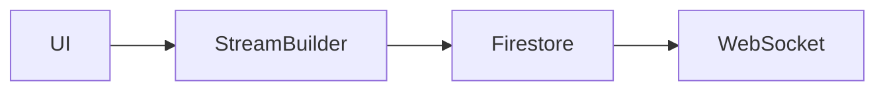

# Backend as a Service

::: columns

:::: column

{ height=100px }

{ height=100px }

::::

:::: column

{ height=100px }

{ height=100px }

::::

:::


---

# The Real Time Ilusion

- Polling vs Sockets vs Server-Sent Events
- Firebase Realtime Database = WebSockets
- `Stream<T>`

---

# App Architecture



---

# Firebase Setup

::: columns

:::: column

## Fresh Project

```bash
npm install -g firebase-tools
firebase login
dart pub global activate flutterfire_cli
flutterfire configure

flutter pub add firebase_core
flutter pub add firebase_database
flutter pub add firebase_auth
```

::::

:::: column

{ height=100px }

::::

:::

---

# Firebase Setup

